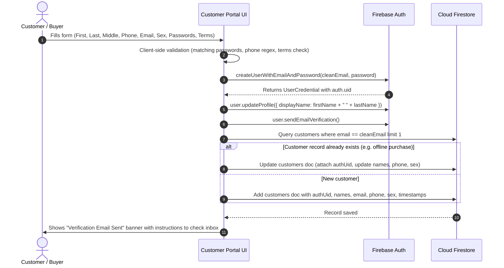

# System Blueprint: Customer Account Creation with Firebase
**Golden Harmonic Memorial Park**

---

## 1. Executive Summary & Objective

This blueprint outlines the architecture, data models, Firebase configuration steps, and security rules for implementing a self-service account registration system for the **Golden Harmonic Memorial Park Customer Portal**.

### Confirmed Requirements & Architectural Decisions:
- **Target Audience**: Customer / Plot Buyer Portal (stored in the `customers` collection).
- **Email Verification**: **Mandatory**. An email verification link is dispatched upon registration. Portal features remain locked until the email is verified (`user.emailVerified === true`).
- **Account Linking**: **Smart Auto-linking**. If an existing record with the same email address exists (e.g. from an inquiry, walk-in reservation, or offline cemetery purchase), the registration links directly to that existing record by attaching `authUid: user.uid`, preventing record duplication.
- **Codebase Safety**: No existing source code files have been modified yet.

---

## 2. Form Requirements & Field Specifications

The registration form contains all specified fields, applying client-side validation and formatting prior to submission:

| Field | Input Type | Validation Rules | Destination |
| :--- | :--- | :--- | :--- |
| **First Name** | `text` | Required, 2–50 chars, trimmed | Firestore (`customers.firstName`) |
| **Middle Name** | `text` | Optional, up to 50 chars, trimmed | Firestore (`customers.middleName`) |
| **Last Name** | `text` | Required, 2–50 chars, trimmed | Firestore (`customers.lastName`) |
| **Contact Number** | `tel` | Required, Philippine format (`^(\+639\|09)\d{9}$`) | Firestore (`customers.phone`) |
| **Email Address** | `email` | Required, standard email regex, trimmed, lowercase | Firebase Auth + Firestore (`customers.email`) |
| **Sex** | `select` | Required (`Female`, `Male`, `Prefer not to say`) | Firestore (`customers.sex`) |
| **Password** | `password` | Required, min 8 chars, 1 uppercase, 1 lowercase, 1 number | Firebase Auth |
| **Confirm Password** | `password` | Required, must match `Password` exactly | Client validation only |
| **Accept Terms & Privacy** | `checkbox` | Required, must be checked (`true`) | Firestore (`customers.termsAccepted`) |

---

## 3. Database Architecture & Data Schema

### 3.1 Firebase Authentication
- **Provider**: Email/Password
- **User Object Attributes**:
  - `uid`: Unique identifier generated by Firebase Auth
  - `email`: User's registered email
  - `emailVerified`: `false` on initial creation, flips to `true` when link in inbox is clicked
  - `displayName`: Formatted string: `${firstName} ${lastName}`

### 3.2 Cloud Firestore Document Schema (`customers` collection)

#### Case A: Auto-linking to an existing customer record
If a document with matching `email` already exists, update the document:
```json
{
  "authUid": "FIREBASE_AUTH_UID",
  "firstName": "Juan",
  "middleName": "Protacio",
  "lastName": "Dela Cruz",
  "fullName": "Juan Dela Cruz",
  "phone": "09171234567",
  "sex": "Male",
  "termsAccepted": true,
  "termsAcceptedAt": "2026-10-04T02:45:00.000Z",
  "updatedAt": "SERVER_TIMESTAMP"
}
```

#### Case B: Creating a new customer record
If no record with matching `email` exists, create a new document in `customers`:
```json
{
  "authUid": "FIREBASE_AUTH_UID",
  "firstName": "Juan",
  "middleName": "Protacio",
  "lastName": "Dela Cruz",
  "fullName": "Juan Dela Cruz",
  "email": "juan.delacruz@example.com",
  "phone": "09171234567",
  "sex": "Male",
  "role": "customer",
  "status": "active",
  "termsAccepted": true,
  "termsAcceptedAt": "2026-10-04T02:45:00.000Z",
  "createdAt": "SERVER_TIMESTAMP",
  "updatedAt": "SERVER_TIMESTAMP"
}
```

---

## 4. Instructions: Firebase Console Setup (What You Need to Do)

Follow these steps directly in the [Firebase Console](https://console.firebase.google.com/project/golden-harmonic-memorial-park):

### Step 1: Enable the Email/Password Provider
1. Log in to [Firebase Console](https://console.firebase.google.com/).
2. Select the **Golden Harmonic Memorial Park** project (`golden-harmonic-memorial-park`).
3. In the left navigation sidebar, navigate to **Build** > **Authentication**.
4. Click on the **Sign-in method** tab.
5. In the list of providers, click on **Email/Password**.
6. Switch the top toggle to **Enabled**.
7. Keep *Email link (passwordless sign-in)* **Disabled**.
8. Click **Save**.

### Step 2: Configure the Email Verification Template
1. In **Authentication**, switch to the **Templates** tab.
2. Click on **Email address verification**.
3. Click the pencil/edit icon to configure:
   - **Sender name**: `Golden Harmonic Memorial Park`
   - **Subject**: `Verify your email for Golden Harmonic Customer Portal`
   - **Reply-to**: `support@golden-harmonic-memorial-park.firebaseapp.com` (or your company email)
4. Click **Save**.

### Step 3: Configure Cloud Firestore Security Rules
Ensure authenticated users can register their customer document and read their own plot/payment information while preventing unauthorized data access.

1. In the left sidebar, navigate to **Build** > **Firestore Database**.
2. Click the **Rules** tab.
3. Verify that the rules permit users to look up and write their own customer profile:
```javascript
rules_version = '2';

service cloud.firestore {
  match /databases/{database}/documents {

    // ── Role helpers ──────────────────────────────────────────────────
    function isSignedIn() {
      return request.auth != null;
    }

    function myRole() {
      return isSignedIn() && exists(/databases/$(database)/documents/users/$(request.auth.uid))
        ? get(/databases/$(database)/documents/users/$(request.auth.uid)).data.role
        : null;
    }

    function isStaffOrHigher() {
      return myRole() in ['staff', 'admin', 'superadmin'];
    }

    function isAdminOrHigher() {
      return myRole() in ['admin', 'superadmin'];
    }

    function isSuperAdmin() {
      return myRole() == 'superadmin';
    }

    // A public "Get a custom quote" lead (site.jsx BrochureForm) is only
    // allowed to create a bare lead — no plan, no payments, no notes, and
    // it must be marked exactly 'lead'.
    function isValidPublicLead() {
      let d = request.resource.data;
      return d.status == 'lead'
        && !('payments' in d)
        && !('plan' in d)
        && !('notes' in d);
    }

    // NEW: Allow a new customer self-registration
    // Must match the authenticated user's UID and email, and cannot inject financial or staff fields.
    function isValidCustomerRegistration() {
      let d = request.resource.data;
      return isSignedIn()
        && d.authUid == request.auth.uid
        && d.email == request.auth.token.email
        && !('payments' in d)
        && !('plan' in d)
        && !('notes' in d);
    }

    // NEW: Allow linking an existing customer record by matching verified email.
    // Cannot modify payments, plan, status, or staff notes.
    function isValidCustomerLink() {
      let diff = request.resource.data.diff(resource.data);
      return isSignedIn()
        && resource.data.email == request.auth.token.email
        && (!('authUid' in resource.data) || resource.data.authUid == null || resource.data.authUid == request.auth.uid)
        && request.resource.data.authUid == request.auth.uid
        && !diff.affectedKeys().hasAny(['payments', 'plan', 'notes', 'status', 'email']);
    }

    // A public brochure-request inquiry (site.jsx) must start as 'new'
    // with type 'brochure_request' — nothing else.
    function isValidPublicInquiry() {
      let d = request.resource.data;
      return d.status == 'new'
        && d.type == 'brochure_request'
        && d.email is string;
    }

    // A customer portal login (site.jsx CustomerPortal) may only ever
    // touch their own paymentSubmissions array — never payments, plan,
    // status, notes, authUid, or anything else on their own record.
    function isValidPortalSubmission(customerId) {
      return isSignedIn()
        && get(/databases/$(database)/documents/customers/$(customerId)).data.authUid == request.auth.uid
        && request.resource.data.diff(resource.data).affectedKeys().hasOnly(['paymentSubmissions']);
    }

    // A public cart checkout (site.jsx CartDrawer)
    function isValidPublicOrder() {
      let d = request.resource.data;
      return d.status == 'pending_payment'
        && d.type == 'cart_checkout'
        && d.email is string
        && d.totalPrice is number;
    }

    // ── products: site + admin both read pricing; only admin+ edits it ──
    match /products/{productId} {
      allow read: if true;
      allow write: if isAdminOrHigher();
    }

    // ── inquiries: public can submit one, staff+ manage them ──
    match /inquiries/{inquiryId} {
      allow create: if isStaffOrHigher() || isValidPublicInquiry();
      allow read, update, delete: if isStaffOrHigher();
    }

    // ── customers: public can create a lead/register, staff+ manage everything,
    //    and customer portal account can read, link, and submit payments ──
    match /customers/{customerId} {
      allow create: if isStaffOrHigher() || isValidPublicLead() || isValidCustomerRegistration();
      allow read, update, delete: if isStaffOrHigher();

      // Customer portal (site.jsx "My Account"):
      // 1. Read own record by authUid OR matching email (for account linking check)
      allow read: if isSignedIn() && (resource.data.authUid == request.auth.uid || resource.data.email == request.auth.token.email);

      // 2. Update payment submissions OR link unlinked profile
      allow update: if isValidPortalSubmission(customerId) || isValidCustomerLink();
    }

    // ── plots: staff-managed only ──
    match /plots/{plotId} {
      allow read, write: if isStaffOrHigher();
    }

    // ── orders: public can create one via checkout, staff+ manage them ──
    match /orders/{orderId} {
      allow create: if isStaffOrHigher() || isValidPublicOrder();
      allow read, update, delete: if isStaffOrHigher();
    }

    // ── users: staff accounts + roles ──
    function targetIsSuperAdmin(uid) {
      return exists(/databases/$(database)/documents/users/$(uid))
        && get(/databases/$(database)/documents/users/$(uid)).data.role == 'superadmin';
    }

    match /users/{uid} {
      allow read: if isSignedIn() && (request.auth.uid == uid || isAdminOrHigher());

      allow create, update: if isSuperAdmin()
        || (isAdminOrHigher()
            && request.resource.data.role in ['staff', 'admin']
            && !targetIsSuperAdmin(uid));

      allow delete: if isSuperAdmin()
        || (isAdminOrHigher() && !targetIsSuperAdmin(uid));
    }

    // ── trash ──
    match /trash/{trashId} {
      allow create, read: if isStaffOrHigher();
      allow update, delete: if isAdminOrHigher();
    }

    // ── everything else: closed by default ──
    match /{document=**} {
      allow read, write: if false;
    }
  }
}
```
4. Click **Publish**.

---

## 5. End-to-End Registration & Verification Flow



---

## 6. Logic Implementation Reference

Below is the production-ready registration function to be integrated into [site.jsx](file:///d:/COMMI/Golden-harmonic-memorial-park-main/site.jsx):

```javascript
async function registerCustomerAccount({
  firstName,
  middleName,
  lastName,
  phone,
  email,
  sex,
  password,
  confirmPassword,
  agreeTerms
}) {
  // 1. Validation
  if (!agreeTerms) {
    throw new Error("You must agree to the Terms of Service and Privacy Policy.");
  }
  if (password !== confirmPassword) {
    throw new Error("Passwords do not match.");
  }
  if (password.length < 8) {
    throw new Error("Password must be at least 8 characters long.");
  }
  if (!firstName.trim() || !lastName.trim()) {
    throw new Error("First and Last names are required.");
  }

  const cleanEmail = email.trim().toLowerCase();
  const cleanPhone = phone.trim();
  const fullName = [firstName.trim(), middleName.trim(), lastName.trim()]
    .filter(Boolean)
    .join(' ');

  // 2. Create Firebase Auth user
  const cred = await window.auth.createUserWithEmailAndPassword(cleanEmail, password);
  const user = cred.user;

  // 3. Set displayName and send verification email
  await user.updateProfile({ displayName: fullName });
  await user.sendEmailVerification();

  // 4. Query Firestore customers collection for existing record
  const existingSnap = await window.db.collection('customers')
    .where('email', '==', cleanEmail)
    .limit(1)
    .get();

  if (!existingSnap.empty) {
    // Auto-link to existing customer record
    const targetDoc = existingSnap.docs[0];
    await window.db.collection('customers').doc(targetDoc.id).update({
      authUid: user.uid,
      firstName: firstName.trim(),
      middleName: middleName ? middleName.trim() : '',
      lastName: lastName.trim(),
      fullName: fullName,
      phone: cleanPhone,
      sex: sex,
      termsAccepted: true,
      termsAcceptedAt: new Date().toISOString(),
      updatedAt: firebase.firestore.FieldValue.serverTimestamp()
    });
  } else {
    // Create new customer profile document
    await window.db.collection('customers').add({
      authUid: user.uid,
      firstName: firstName.trim(),
      middleName: middleName ? middleName.trim() : '',
      lastName: lastName.trim(),
      fullName: fullName,
      email: cleanEmail,
      phone: cleanPhone,
      sex: sex,
      role: 'customer',
      status: 'active',
      termsAccepted: true,
      termsAcceptedAt: new Date().toISOString(),
      createdAt: firebase.firestore.FieldValue.serverTimestamp(),
      updatedAt: firebase.firestore.FieldValue.serverTimestamp()
    });
  }

  return user;
}
```

---

## 7. Email Verification Enforcement Strategy

When a user signs in through the customer portal:
1. Check `window.auth.currentUser.emailVerified`.
2. If `false`:
   - Display a clean banner: *"Please verify your email address. We sent a verification link to **{user.email}**."*
   - Provide a **"Resend Verification Email"** button (`await user.sendEmailVerification()`).
   - Provide a **"I've Verified My Email"** button (`await user.reload()` then re-check `user.emailVerified`).
   - Prevent displaying sensitive financial balances or payment upload forms until verified.
3. If `true`:
   - Render the customer dashboard and payment schedule normally.

---

## 8. Form UI Component Layout

In [site.jsx](file:///d:/COMMI/Golden-harmonic-memorial-park-main/site.jsx), the form can be toggled using a `'register'` mode inside `CustomerPortal`:

```jsx
{mode === 'register' && (
  <form onSubmit={handleRegister} className="gh-portal-form">
    <div className="gh-portal-form-grid">
      <div>
        <label>First Name *</label>
        <input type="text" value={reg.firstName} onChange={e => setReg({...reg, firstName: e.target.value})} required />
      </div>
      <div>
        <label>Middle Name</label>
        <input type="text" value={reg.middleName} onChange={e => setReg({...reg, middleName: e.target.value})} placeholder="Optional" />
      </div>
      <div className="full">
        <label>Last Name *</label>
        <input type="text" value={reg.lastName} onChange={e => setReg({...reg, lastName: e.target.value})} required />
      </div>
      <div>
        <label>Contact Number *</label>
        <input type="tel" value={reg.phone} onChange={e => setReg({...reg, phone: e.target.value})} placeholder="0917 123 4567" required />
      </div>
      <div>
        <label>Sex *</label>
        <select value={reg.sex} onChange={e => setReg({...reg, sex: e.target.value})} required>
          <option value="" disabled>Select</option>
          <option value="Female">Female</option>
          <option value="Male">Male</option>
          <option value="Prefer not to say">Prefer not to say</option>
        </select>
      </div>
      <div className="full">
        <label>Email Address *</label>
        <input type="email" value={reg.email} onChange={e => setReg({...reg, email: e.target.value})} required />
      </div>
      <div>
        <label>Password *</label>
        <input type="password" value={reg.password} onChange={e => setReg({...reg, password: e.target.value})} minLength={8} required />
      </div>
      <div>
        <label>Confirm Password *</label>
        <input type="password" value={reg.confirmPassword} onChange={e => setReg({...reg, confirmPassword: e.target.value})} minLength={8} required />
      </div>
      <div className="full">
        <label style={{ display: 'flex', alignItems: 'center', gap: 8, cursor: 'pointer', marginTop: 12 }}>
          <input type="checkbox" checked={reg.agreeTerms} onChange={e => setReg({...reg, agreeTerms: e.target.checked})} required />
          <span>I accept the <a href="#terms" target="_blank">Terms of Service</a> and <a href="#privacy" target="_blank">Privacy Policy</a></span>
        </label>
      </div>
    </div>
    {error && <div className="gh-portal-err">{error}</div>}
    <button type="submit" className="gh-portal-btn-primary" disabled={busy}>
      {busy ? 'Creating Account…' : 'Create Account'}
    </button>
    <button type="button" className="gh-portal-link-btn" onClick={() => setMode('login')}>
      Already have an account? Sign In
    </button>
  </form>
)}
```

---

## 9. Error Mapping Table

| Firebase Auth Error Code | User-Friendly Message Displayed |
| :--- | :--- |
| `auth/email-already-in-use` | "An account with this email address already exists. Please sign in or reset your password." |
| `auth/invalid-email` | "Please enter a valid email address." |
| `auth/weak-password` | "Password should be at least 8 characters long and contain both letters and numbers." |
| `auth/too-many-requests` | "Too many attempts. Please wait a few minutes before trying again." |
| `auth/network-request-failed` | "Network error. Please check your internet connection and try again." |
